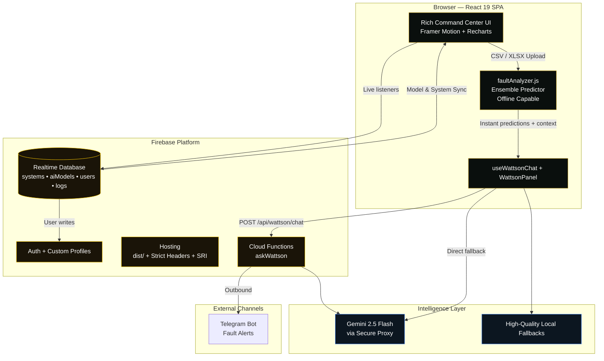

# VoltIQ

**Enterprise Solar Intelligence Platform**

> Real-time inverter fault monitoring • Predictive diagnostics • AI-augmented mission control for distributed industrial solar fleets.

[](https://react.dev/)
[](https://firebase.google.com/)
[](https://vitejs.dev/)
[](https://ai.google.dev/)

---

## Table of Contents

- [Executive Summary](#executive-summary)
- [Why VoltIQ Is Different](#why-voltiq-is-different)
- [Core Modules](#core-modules)
- [Fault Taxonomy (F0–F8)](#fault-taxonomy-f0f8)
- [Technology Stack](#technology-stack)
- [Security Model](#security-model-enforced-at-the-database-layer)
- [Project Structure](#project-structure-high-level)
- [Getting Started](#getting-started)
- [Data & Model Notes](#data--model-notes)
- [Design Philosophy](#design-philosophy)
- [Scripts & Tooling](#scripts--tooling)
- [Future Directions](#future-directions-illustrative)
- [Credits & Provenance](#credits--provenance)

---

## Executive Summary

VoltIQ is a production-grade, browser-native command center for operating large-scale solar inverter infrastructure. It combines deterministic machine-learning-style fault classification, a rich live telemetry experience, a full MLOps training cockpit, zero-trust identity governance, multi-channel alerting, and a context-aware conversational AI named **Wattson** (powered by Gemini 2.5 Flash via a secure Firebase Cloud Function proxy).

Built with React 19, Framer Motion, Recharts, and Firebase Realtime Database, VoltIQ delivers sub-second reactivity across fleet views, diagnostics, model governance, and security workflows — all while maintaining strict security boundaries and graceful degradation when cloud AI is unavailable.

It was designed from the ground up as a **mission-control experience**: every screen uses precise terminology ("Command Center", "War Board", "Governance Gate", "Inference Sandbox"), dark solar aesthetics, live updating elements, and deep integration between human operators and intelligent systems.

---

## Why VoltIQ Is Different

- **Hybrid Intelligence**: A sophisticated client-side fault prediction engine (ensemble of decision trees + domain rules) runs instantly on any telemetry — even offline. It feeds structured context directly into the LLM-powered Wattson for higher-order reasoning.
- **Complete MLOps in the Browser**: Admins can ingest real datasets (CSV / XLSX), explore class distributions, inspect confusion matrices, simulate retraining, manage versioned model registry entries in Firebase, monitor drift risk, and gate deployments.
- **Zero-Trust by Default**: New users are created in `pending` state. Database rules and client guards ensure only approved admins can read user lists, activity logs, or mutate roles. Live session invalidation on suspension.
- **Context-Rich AI Assistant**: Wattson sees the current page, selected system, live dashboard metrics, user role, and conversation history. It supports specialized modes (diagnose, analyze, troubleshoot, summarize, report) and speaks both English and Arabic.
- **Industrial Data Resilience**: The telemetry parser normalizes wildly varying real-world column names from academic and field datasets into a canonical 8-feature schema (Ia, Ib, VDC, IDC, T1–T3, VD) used by the predictor.
- **Enterprise Hardening**: Strict Content-Security-Policy, SRI on build, activity audit trail, Telegram dispatch for alerts, comprehensive permission matrix, and backup/restore controls.

---

## Architecture at a Glance



**Data flows**:
- Telemetry → client-side `faultAnalyzer` → instant F0–F8 + risk + recommendations
- Structured context (page + selection + metrics) injected into every Wattson prompt
- All operational state (fleet, models, approvals, logs) lives in Realtime Database with rules-enforced RBAC
- Production AI calls always go through the Cloud Function first

---

## Core Modules

### 1. Dashboard — Live Command Center
- Hero status with health score and system state (normal / warning / critical)
- AI Prediction Core showing top predicted fault class (F0–F8), confidence, and immediate repair recommendation
- Live Sensor Matrix with simulated fluctuating telemetry (voltage, current, power, temperature)
- AI Inference Sandbox for what-if analysis
- Performance Intelligence + Fault History Preview
- Smart Alert Strip for immediate acknowledgement

### 2. Systems — Fleet Topology & Control
- Interactive SVG Live System Network Map (animated nodes, status coloring)
- Fleet KPI Matrix and Health Radar
- Critical Systems Spotlight + AI Fleet Insights
- System Cards Grid with inline power/energy/health
- Full CRUD (Firebase-synced) + rich detail and diagnostics modals
- Priority Command Panel

### 3. Alerts — Operations & Escalation
- High-density alert stream with filters (severity, status, search)
- SLA pressure indicators and breached alerts
- Responder War Board + Escalation Ladder
- Immediate Action Command Bar
- Notification Routing + AI Alert Commander
- Active Alerts Operations Log

### 4. AI Training Center (Admin-only)
- Dataset Ingestion Command Center (drag-and-drop CSV/XLSX support via xlsx + custom parser)
- Training Configuration Cockpit
- Live Training Operations Monitor
- Model Registry & Version Governance
- Model Performance Intelligence Dashboard
- Confusion Matrix Misclassification Lab
- Telemetry Feature Mapping Console
- Model Drift & Retraining Intelligence
- Deployment Readiness Gate + Governance Audit Trail

### 5. Reports
- Report Builder Workspace
- Boardroom Report Preview
- Publishing Suite Hero

### 6. Users & Identity (Admin-only)
- User Directory Command Board with powerful filters
- Admin Approval Queue
- Zero-Trust Permission Matrix + Access Scope Assignment
- Identity Risk Review Board
- Permission Change Impact Simulator
- Invitation Onboarding + Identity Audit Trail

### 7. Settings — Deep Platform Control
- Appearance & Interface controls
- Security Preference Layer
- Units, Limits & Threshold Configuration
- Data Sync (Firebase) & Backup/Restore/Export
- Notification Defaults + Integration Governance
- Monitoring Behavior Console
- Advanced System Controls + Configuration Diff Review
- Workspace Governance + full Settings Activity Audit Log

### 8. Wattson — The AI Energy Assistant (Global)
- Floating launcher accessible from any protected route
- Multi-mode selector: ask • analyze • diagnose • summarize • report • troubleshoot
- Context chips showing current page / selection / live data
- Message modification actions (make shorter, simplify, convert to action list)
- Sound design, typing indicators, quick actions, stop generation
- Three-tier resilience:
  1. Secure Firebase Function proxy (`/api/wattson/chat` → Gemini)
  2. Direct client Gemini call (when key available in env)
  3. High-quality local fallback responses tailored per route
- Sarcastic, competent, witty personality — "little patience for simple errors, deeply dedicated to solar grid efficiency"
- Telegram integration for outbound fault alerts

---

## Fault Taxonomy (F0–F8)

The deterministic predictor classifies telemetry into one of nine states:

| Code | Title                        | Severity  | Typical Action |
|------|------------------------------|-----------|----------------|
| F0   | Normal operation             | normal    | Continue monitoring |
| F1   | Overcurrent / current imbalance | critical | Inspect wiring & sensors |
| F2   | DC undervoltage / voltage sag | critical | Check PV strings, fuses, connectors |
| F3   | Thermal overload             | critical  | Cooling diagnostics, clean fans, derate |
| F4   | Power drop anomaly           | warning   | Investigate shading / MPPT / efficiency |
| F5   | Thermal sensor mismatch      | warning   | Sensor inspection / replacement |
| F6   | DC overvoltage / grid sync risk | critical | Isolate input, verify limits |
| F7   | Unknown inverter anomaly     | critical  | Watch + export diagnostics |
| F8   | External sensor / relay alarm| warning   | Review alarms, relays, obstructions |

The engine also computes risk scores and vote distributions across an ensemble of domain-specific decision trees. It gracefully handles both the canonical ML schema and varied industrial "Solar Data" schemas.

Baseline reference dataset: **10,892 rows** from `converted_dataset.csv` (Ia/Ib/VDC/IDC/T1/T2/T3/VD + FDD label).

---

## Technology Stack

| Layer              | Technology                                      |
|--------------------|-------------------------------------------------|
| Frontend           | React 19, React Router 7, Framer Motion, Recharts, Lucide-react, qrcode.react |
| Build & Tooling    | Vite 8, ESLint, add-sri.js (Subresource Integrity) |
| State & Data       | Firebase Realtime Database (live listeners), localStorage analysis cache |
| Authentication     | Firebase Auth (email/password + persistence) with custom profile + approval workflow |
| Backend / AI       | Firebase Cloud Functions (v2 HTTPS) + Gemini 2.5 Flash |
| Data Ingestion     | xlsx (Excel), custom streaming CSV parser with alias normalization |
| Alerting           | Telegram Bot API (with CORS proxy fallback) |
| Styling            | Custom CSS modules per domain (dashboard, systems, alerts, ai-training, users, etc.) + Google Fonts (Cinzel, Cormorant, Inter, Outfit) |
| Security           | Hardened Firebase Database Rules, strict CSP + HSTS + Permissions-Policy on Hosting, activity logging |

**Key architectural decisions**:
- All heavy predictive logic runs client-side for privacy, speed, and offline resilience.
- Cloud LLM calls are proxied so API keys never leak to the browser in production.
- Realtime Database is the single source of truth for systems, models, users, and logs.
- Every privileged mutation is also written to an append-only `activityLogs` collection.

---

## Security Model (Enforced at the Database Layer)

```jsonc
// Simplified excerpt from database.rules.json
"users": {
  ".read": "auth != null && isApprovedAdmin(auth.uid)",
  "$uid": {
    ".read": "$uid === auth.uid || isApprovedAdmin(auth.uid)",
    ".write": "$uid === auth.uid || isApprovedAdmin(auth.uid)",
    "role": { ".validate": "isApprovedAdmin(...) || initial user creation rules" },
    "status": { ".validate": "..." }
  }
}
```

- New registrations always land with `status: "pending"` and `role: "user"`.
- Only approved admins can read the full user directory or activity logs.
- Client components double-check before rendering admin surfaces.
- Suspended/rejected users are forcibly logged out on next protected action.
- All writes to activity logs are validated to come from the authenticated user.

See [DEPLOY.md](./DEPLOY.md) for full bootstrap procedure and recommended future hardening (App Check, Cloud Functions for role changes, etc.).

---

## Project Structure (High Level)

```
src/
├── components/
│   ├── ai-training/          # 16 specialized MLOps UI components
│   ├── alerts/               # Full alert command surface
│   ├── chatbot/              # Wattson + VoltIQBot (launcher + panel + avatars + modes)
│   ├── dashboard/            # Live command center tiles
│   ├── systems/              # Fleet map, cards, modals, radar, etc.
│   ├── users/                # Advanced IAM surfaces
│   ├── reports/, settings/   # Builder & governance
│   └── Sidebar.jsx, CommandHeader.jsx, ...
├── pages/                    # Route-level containers (Dashboard, Systems, Alerts, ...)
├── data/                     # Rich mock data + realistic baseline analysis
├── utils/
│   ├── faultAnalyzer.js      # ⭐ The heart — schema normalization + ensemble predictor
│   ├── wattson*.js           # Prompt builder, fallbacks, sound
│   ├── telegramService.js
│   └── activityLogger.js
├── context/                  # AuthContext + ProtectedRoute
├── hooks/                    # useAuth, useWattsonChat, useWattsonMood
├── styles/                   # Domain-specific CSS (global + 10+ feature stylesheets)
└── config/                   # firebase.js, permissions.js
```

Root also contains:
- `functions/index.js` — `askWattson` HTTPS function
- `dataset/` — real solar telemetry (CSV + Excel templates)
- Static prototype HTMLs (`voltiq-*.html`) — early visual explorations
- `add-sri.js`, `createAdmin.js`, `updateUser.js` — operational scripts

---

## Getting Started

### Prerequisites
- Node.js 20+
- Firebase project with **Authentication**, **Realtime Database**, and **Hosting** enabled
- (Optional but recommended) Gemini API key for full Wattson capabilities
- (Optional) Telegram bot token for mobile alerts

### 1. Install & Configure

```powershell
git clone <your-repo>
cd VoltIQ
npm install
```

Copy `.env.example` → `.env` and fill in your Firebase web config (from Firebase Console → Project Settings).

Add your Gemini key for AI:

```env
VITE_GEMINI_API_KEY=your_gemini_key_here
VITE_TELEGRAM_BOT_TOKEN=optional_bot_token
```

### 2. Run Locally

```powershell
npm run dev
```

App runs at `http://localhost:5173`. You will be redirected to Login.

### 3. Bootstrap the First Administrator (Critical)

Because of the security model, the first user who registers will be stuck in "pending".

After registration:

1. Go to Firebase Console → Realtime Database → `users` node.
2. Locate the new UID.
3. Set (or create) the record:

```json
{
  "your-uid-here": {
    "email": "admin@yourcompany.com",
    "role": "admin",
    "status": "approved",
    "createdAt": 1700000000000
  }
}
```

That user can now log in and will see the full admin navigation (AI Training, Users, etc.). All subsequent users can be approved/rejected/promoted through the UI.

### 4. Build for Production

```powershell
npm run build
```

The build step automatically runs `add-sri.js` to inject Subresource Integrity hashes.

### 5. Deploy

See [DEPLOY.md](./DEPLOY.md) for complete Firebase Hosting + rules deployment instructions and security notes.

Live example (replace with your project):
https://voltiq-9c37b.web.app

---

## Data & Model Notes

- The `faultAnalyzer.js` predictor was tuned against the included 10,892-row converted dataset.
- Real-world column names from field loggers are aggressively normalized via alias maps.
- All analysis results (class counts, risk, recommendations) can be persisted to localStorage for demo continuity.
- The AI Training Center treats uploaded files as training runs; model metadata is persisted to the `aiModels` collection in Realtime Database for cross-session registry visibility.

---

## Design Philosophy

VoltIQ rejects generic dashboard aesthetics. Every pixel communicates **operational gravity**:
- Precise typography hierarchy (Cinzel for display, Inter/Outfit for body)
- Command-rail layouts, war-board tables, cockpit controls
- Subtle live motion (Framer Motion) that feels expensive but never distracting
- Consistent "gold / deep green / charcoal" solar palette
- Every admin action is logged and every state transition has immediate visual feedback

The goal: an operator should feel they are inside a high-end control room, not browsing a web app.

---

## Scripts & Tooling

- `npm run dev` — Vite dev server
- `npm run build` — Production build + SRI injection
- `npm run preview` — Local preview of the dist build
- `npm run lint` — ESLint
- Root helper scripts: `createAdmin.js`, `updateUser.js`

---

## Future Directions (Illustrative)

- Move user role/status mutations behind Cloud Functions + Admin SDK for stronger guarantees
- Add Firebase App Check + reCAPTCHA Enterprise
- Enable real device telemetry ingestion (MQTT / WebSocket bridge)
- Persistent model artifacts + actual training jobs (Vertex AI or custom Cloud Run)
- Multi-language full localization (Arabic support already partially wired)
- Offline-first PWA + background sync for field technicians

---

## Credits & Provenance

VoltIQ was architected and implemented as a complete, self-contained enterprise simulation showcasing what is possible with modern frontend + serverless + applied ML on real inverter telemetry.

The included dataset derives from publicly referenced solar fault detection research (canonical 8-feature schema). All other data, UI logic, security model, and assistant personality are original to the project.

---

**VoltIQ — Turning solar telemetry into decisive, intelligent action at the speed of light.**

For deployment hardening details, see [DEPLOY.md](./DEPLOY.md).

Questions or contributions: open an issue or reach the maintainers via the platform's own Wattson interface.
